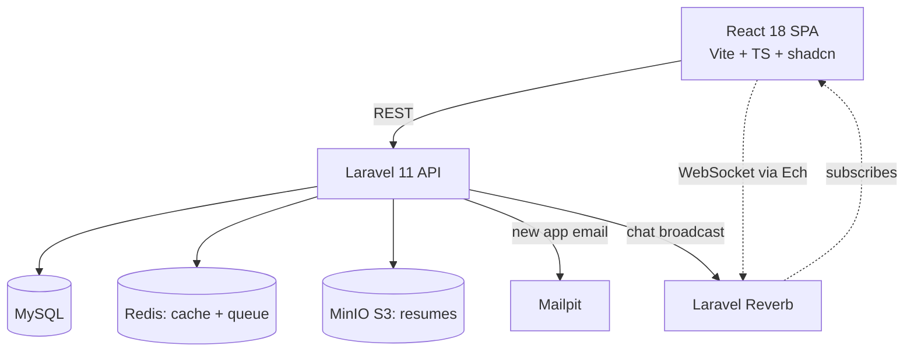

# Job Portal — Laravel 11 + React 18 (Flagship)

[](https://github.com/your-username/jobportal-laravel-react/actions/workflows/ci.yml)


> Replace `your-username` in the badge URLs after you push the repo to GitHub.

A full-stack job board with **3 roles** (Candidate, Recruiter, Admin), **realtime recruiter–candidate chat** via Laravel Reverb WebSockets, resume uploads, application pipelines, and a modern shadcn/ui frontend.

[Live demo (TODO)](https://example.com) · [Video walkthrough (TODO)](https://example.com)

## What this demonstrates

- **Monorepo**: `backend/` (Laravel 11 API) + `frontend/` (React 18 + TS + Vite)
- **3-role RBAC** with Sanctum tokens and Spatie permissions
- **Realtime chat** between recruiter ↔ candidate using **Laravel Reverb** WebSockets and the official `laravel-echo` client — with **presence (online/offline), typing indicators, and read receipts** (`UserTyping` + `MessagesRead` broadcast events on a presence channel)
- **Laravel Notifications** (database + broadcast) for new application / new message / status change, surfaced as a live unread badge via `GET /api/notifications`
- **Recruiter analytics** — job views, application volume, and an applied→hired conversion funnel at `GET /api/analytics/dashboard` with a dashboard page
- **Resume uploads** to S3-compatible storage (MinIO in dev, S3 in prod)
- **Application pipeline** (Kanban) — applied -> screening -> interview -> offer -> hired/rejected
- **Full-text job search** with MySQL fulltext indexes
- **OpenAPI docs** via Scribe at `/docs/api`
- **Observability** — `X-Request-Id` middleware, structured JSON logs, `/api/metrics`
- **shadcn/ui design system** + **light/dark theme toggle** + mobile responsive
- **Frontend hardening** — TanStack Query with optimistic mutations, a top-level error boundary
- **CI quality gates** — Pint + Larastan (level 5) + Pest (backend), Vitest + tsc (frontend)
- **Pest** tests on the backend, **Vitest** on the frontend

## Architecture



## Roles

| Role      | Capabilities                                                              |
|-----------|---------------------------------------------------------------------------|
| Candidate | profile + resume, job search, save jobs, apply, message recruiter, track  |
| Recruiter | company profile, post jobs, applicant Kanban, chat candidates, analytics  |
| Admin     | moderate jobs, feature jobs, ban users, reports                           |

## Tech stack

- **Backend:** Laravel 11, PHP 8.3, MySQL 8, Redis 7, Sanctum, Spatie Permission, Laravel Reverb, MinIO (S3)
- **Frontend:** React 18, Vite, TypeScript, TailwindCSS, shadcn/ui, TanStack Query, Zustand, laravel-echo, pusher-js (Reverb-compatible client)

## Quick start

```bash
git clone <repo>
cd jobportal-laravel-react
cp backend/.env.example backend/.env
cp frontend/.env.example frontend/.env
docker compose up -d
docker compose exec backend composer install
docker compose exec backend php artisan key:generate
docker compose exec backend php artisan migrate --seed
docker compose exec frontend npm install
# Backend:  http://localhost:8000
# Frontend: http://localhost:5173
# Mailpit:  http://localhost:8025
# MinIO:    http://localhost:9001 (admin/secretsecret)
# Reverb:   ws://localhost:8080
```

Seeded users:
- `admin@jobs.test / password`
- `recruiter@jobs.test / password` (company: Acme Corp)
- `candidate@jobs.test / password`

## Key implementation highlights

- Realtime chat broadcasting: [backend/app/Events/MessageSent.php](backend/app/Events/MessageSent.php) + private channel auth in [backend/routes/channels.php](backend/routes/channels.php)
- Frontend Echo wiring: [frontend/src/lib/echo.ts](frontend/src/lib/echo.ts)
- Kanban DnD pipeline: [frontend/src/pages/recruiter/ApplicantsKanban.tsx](frontend/src/pages/recruiter/ApplicantsKanban.tsx)
- Resume signed-URL upload: [backend/app/Http/Controllers/Api/ResumeController.php](backend/app/Http/Controllers/Api/ResumeController.php)

## Tests

```bash
docker compose exec backend ./vendor/bin/pest
docker compose exec frontend npm test
```

## Deploy

See [DEPLOY.md](DEPLOY.md). Railway-friendly (backend + Reverb as separate services).

<!-- ownership:author -->
---

## Author

**Umair** &mdash; [@umairjutt](https://github.com/umairjutt)

Designed, built and maintained by me. Licensed under the [MIT License](LICENSE).